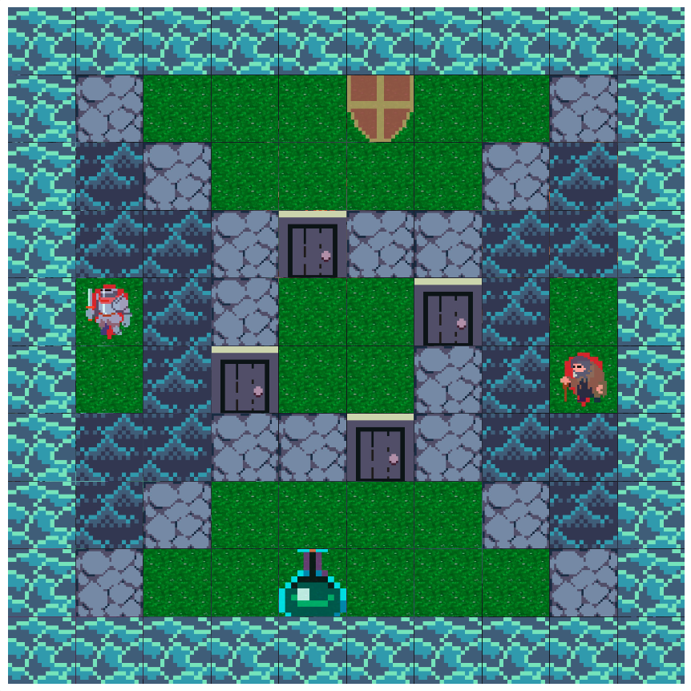

# Medieval Turn-Based Strategy Game

⚔️ A **multiplayer medieval-themed turn-based strategy game** with a **client-server architecture**, utilizing Angular for the frontend and NestJS for the backend. This game combines strategy and RPG elements, featuring grid-based maps, customizable gameplay modes, and a rich combat system.


---

## Table of Contents

1. [Overview](#overview)
2. [Project Structure](#project-structure)
3. [Key Features](#key-features)
4. [Installation](#installation)
5. [Running the Application](#running-the-application)
6. [Testing](#testing)
7. [Technologies Used](#technologies-used)
8. [Contributing](#contributing)
9. [License](#license)
10. [Contact](#contact)

---

## Overview

This game offers a unique blend of **turn-based strategy** and **role-playing elements**. Players compete on grid-based maps with varied terrains, collect items, and engage in strategic combat. Features include:

-   **Two gameplay modes**: Classic and Capture the Flag (CTF).
-   **Multiplayer support**: Real-time updates using Socket.IO.
-   **Interactive maps**: Multiple tile types and scalable map sizes.



---

## Project Structure

The repository is organized as follows:

```
client/
    ├── src/
    │   ├── app/
    │   │   ├── components/
    │   │   │   ├── admin-item/             # Admin controls and settings
    │   │   │   ├── attribute-selection/    # Player attribute configuration
    │   │   │   ├── avatar-slider/          # Player avatar selection
    │   │   │   ├── base-map/               # Core map rendering
    │   │   │   ├── chat/                   # In-game chat system
    │   │   │   ├── choose-item-modal/      # Item selection interface
    │   │   │   ├── combat-interface/       # Combat UI and controls
    │   │   │   ├── edit-header-dialog/     # Map editor header
    │   │   │   ├── import-dialog/          # Map import functionality
    │   │   │   ├── logs/                   # Game event logging
    │   │   │   └── navigate-dialog/        # Navigation controls
    │   │   ├── modules/
    │   │   │   └── material.module.ts      # Angular Material UI components
    │   │   ├── pages/
    │   │   │   ├── edit-page/              # Map editor page
    │   │   │   ├── game-page/              # Main game page
    │   │   │   └── material-page/          # UI components page
    │   │   └── services/                 # Game logic and state management
    │   ├── assets/                      # Static resources
    │   ├── environments/                # Environment configurations
    │   └── index.html                   # Main HTML entry
common/                                 # Shared code between client & server
    ├── combat-actions.ts               # Combat system types
    ├── game-structure.ts               # Core game structure definitions
    ├── global-stats.ts                 # Global game statistics
    ├── player-message.ts               # Player communication types
    └── player.ts                       # Player entity definitions
server/
    └── app/
        ├── gateways/                     # WebSocket communication
        │   ├── action/                   # Game action handlers
        │   └── match/                    # Match management
        └── services/                    # Server-side game logic
            ├── action-button/            # Action system
            ├── action/                   # Core game actions
            ├── combat/                   # Combat system
            ├── game.service.ts           # Game state management
            ├── map-validation.ts         # Map validation logic
            └── movement/                 # Movement system
```

-   **`client/`**: Angular frontend for the game interface.
-   **`server/`**: NestJS backend for game logic and real-time communication.
-   **`common/`**: Shared logic and types between client and server.

---

## Key Features

### Game Structure

-   **Client-Server Architecture**: Built with Angular and NestJS.
-   **Real-Time Multiplayer**: Supports multiple players using Socket.IO.
-   **Grid-Based Maps**: Interactive tiles with unique properties like walls, doors, ice, and water.

### Gameplay Modes

-   **Classic Mode**: Standard turn-based gameplay.
-   **Capture the Flag (CTF)**: Compete to capture the opposing team's flag.

### Core Mechanics

-   **Combat System**:
    -   Dice-based attack and defense rolls.
    -   Escape mechanics and inventory usage.
-   **Player Attributes**:
    -   Health, Speed, Attack, Defense, and Bonus Dice.
-   **Turn-Based Actions**:
    -   Move using a point budget.
    -   Interact with doors and items.
    -   Engage in combat.

### Map Features

-   **Customizable Maps**: Choose from small, medium, or large maps.
-   **Dynamic Tiles**: Including walls, doors, ice, water, and starting points.
-   **Item Placement**: Strategically placed items to enhance gameplay.

### Special Features

-   **Debug Mode**: Enable admin controls with the `D` key.
-   **Virtual Players**: AI opponents for single-player scenarios.
-   **Turn Timer**: Manage pacing for player turns and combat.

---

## Installation

### Prerequisites

Ensure the following tools are installed:

-   **Node.js** (14.x or higher)
-   **npm** (6.x or higher)
-   **MongoDB** (running locally or on a server)

### Steps

1. Clone the repository:

2. Install exact dependency versions using `npm ci`:
    - For the client:
        ```bash
        cd client
        npm ci
        ```
    - For the server:
        ```bash
        cd ../server
        npm ci
        ```

---

## Running the Application

### Development Mode

1. Start the MongoDB server.
2. Start the NestJS backend:
    ```bash
    cd server
    npm start
    ```
3. Start the Angular frontend:
    ```bash
    cd client
    npm start
    ```

The client should now be accessible in your browser at `http://localhost:4200`.

---

## Testing

### Unit Tests

Run tests for both client and server:

-   **Client**:
    ```bash
    cd client
    npm run test
    ```
-   **Server**:
    ```bash
    cd server
    npm run test
    ```

### Test Coverage

Generate coverage reports:

-   **Client**:
    ```bash
    cd client
    npm run coverage
    ```
-   **Server**:
    ```bash
    cd server
    npm run coverage
    ```

---

## Technologies Used

### Client

-   **Angular**, **TypeScript**, **RxJS**, **Angular Material**

### Server

-   **NestJS**, **TypeScript**, **Mongoose**, **Socket.IO**

### Database

-   **MongoDB**

### Testing

-   **Jasmine**, **Karma**, **Jest**

---

## License

This project is private and for **educational purposes only**.

---
